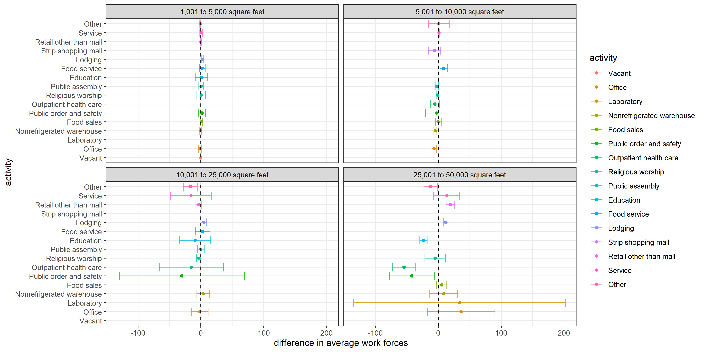
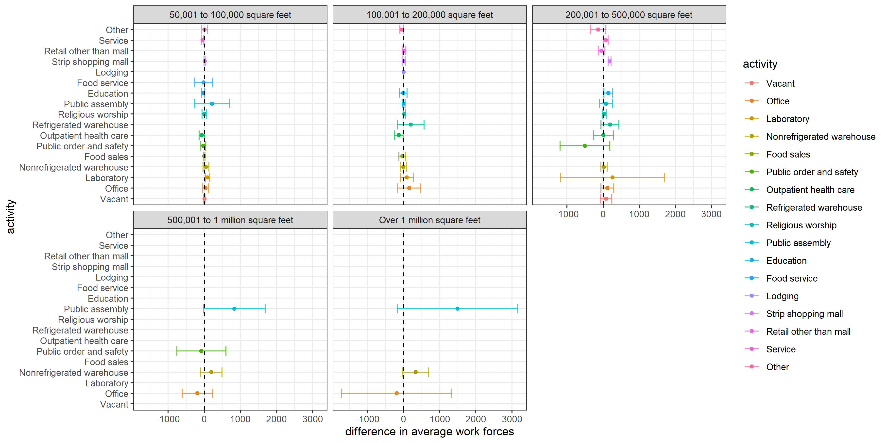

```{r setup, include=FALSE}
knitr::opts_chunk$set(echo = TRUE)
```

#### README

This is a write up to Final Project for Stats 506 in Fall 2020.

To build this document, run 
`Rscript -e "rmarkdown::render('./final_project_Hongfan.Rmd')"` at the command line.    
  
For more information about the code, please visit my Github 
[REPO](https://github.com/HongfanChen/Stats506_final_project)

### 1. Introduction

People usually think commercial buildings open 24 hours would need more work forces to keep the building running. However, is that really so? I decide to answer this question using 2012 CBECS data and let the evidence speak.  
Here's my question:

> **Do commercial buildings open 24 hours have larger average work forces than those that are not?  Does this depend on square footage category and principal activity of the building?**    
    
  Since we want to figure out whether differences we might observe are reflective of how the buildings are used (e.g. retail, office space, etc) or of differences in size, we stratify the data by square footage category and principal building activity to facilitate a simple and direct comparison.
  
### 2. Data / Methods

##### Data sets and variables

I will use 2012 US Commercial Building Energy Consumption Survey(
[CBECS](https://www.eia.gov/consumption/commercial/data/2012/index.php?view=microdata)) data.    
Here's the variables that I choose: `PUBID`, `NWKER`, `OPEN24`, `SQFTC`, `PBA`, `FINALWT`, `FINALWT1-FINALWT197`.  

##### The analysis

“Average work forces was computed for each commercial building and compared visually by square footage category and principal activity of the building. All estimates are given with 95% confidence intervals computed using the balance repeated replicate weights as described in the [documentation](https://www.eia.gov/consumption/commercial/data/2012/pdf/user_guide_public_use_aug2016.pdf)  

*  Using **jackknife** method, variances are estimated by:  

<center>
$\hat{V} (\hat{\theta}) = \sum_{r=1}^R \alpha_r(\hat{\theta}_r - \hat{\theta})^2$
</center>
  
*  95% Confidence intervals are constructed using:  
    
<center>
$\hat{\theta} \pm \Phi^{-1}(.975)\sqrt{\hat{V}(\hat{\theta})}$
</center>

**NOTE**:  
*1. Buildings that have only one status of `OPEN24` have been removed from the final analysis, because I want a 1-1 comparison, and these buildings can not be used for computing difference.*

### 3. Results

#### Code Organization

There is only one file needed here to perform analysis: `final.R`

```{r analysis, message = FALSE, warning=FALSE}
source('./final.R')
```

#### TABLE: Average Work Forces and Difference

```{r complete_table, fig.cap = cap}
cap = paste0(
"**Table 1.** *Average work forces and difference of two status.*",
" Values round off to 3 decimal digit, with 95% confidence intervals, ",
"grouped by square footage category.")
DT::datatable(tab)
```

### Difference of Average work forces. {.tabset .tabset-fade .tabset-pills}

#### First Group

```{r plot_1}

```

#### Second Group

```{r plot_2}

```

### 4. Conclusion / Discussion

The answer for the question is:

> **It depends.**

When buildings are open 24 hours, **Laboratory, public assembly, strip shopping mall, vacant, and nonrefrigerated warehouse** have more work forces, while buildings used for **public order and safety, education, outpatient health care** have less work forces. Average work forces in scenarios like **service, retail or office** seems **NOT** to be related with open 24 hours or not.

In some places, the average work forces are related with square footage. Big buildings hold activity for *religious worship* requires more work forces if they are open 24 hours, but this isn't true when buildings are small.
  
#### **LimTation**

In real life, the average work forces would be affected by more **factors**. Things are much more complicated than what data shows, the variances are large among many buildings, so the outcome may be incorrect unless we have more observations.